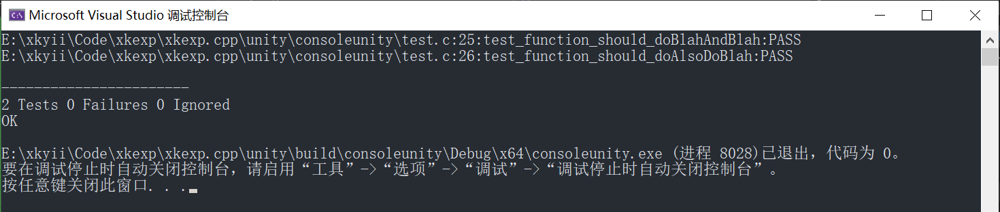

C/Cpp试验场

## 目录说明
```
└─ xkexp.cpp                    组织名,总目录
   ├─ vs                        Visual Studio 试验
   ├─ test                      测试框架 试验
   │  ├─ doctest                doctest 试验
   │  └─ unity                  unity 试验
   └─ README.md                 说明文件(本文件)
```


## vs

### `props` 试验
编译临时文件统一生成到`build`目录.

## test

### `doctest` 试验
- [doctest](https://github.com/doctest/doctest)

这是一个`C++`测试框架,纯`C`是用不了的,但是其不是侵入性,如果能接受测试项目是`C++`项目的话,也是不错的.

### `unity` 试验
- [unity](https://github.com/ThrowTheSwitch/Unity)

1. 参考资料少,基本上只能靠官方文档
2. 关于如何开始使用的介绍非常少,建个项目懵半天
3. 需要导入`c`文件,嗯,不是说不行,只能说用多纯头文件有点不习惯吧
4. 输出没有彩色,并且格式挺呆的

额,总体不是很推荐了

